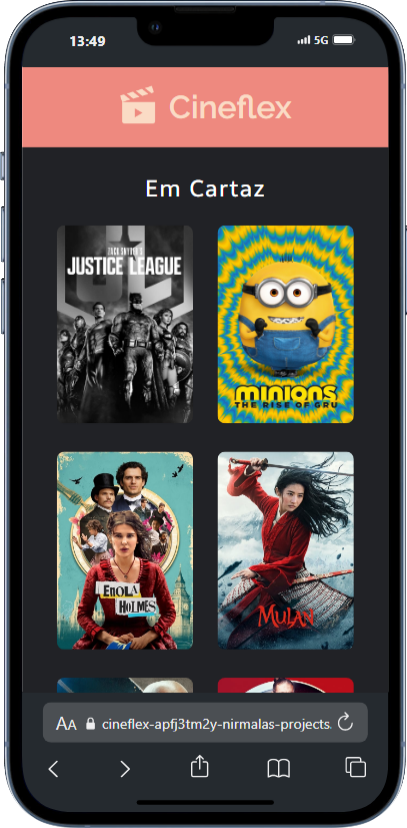
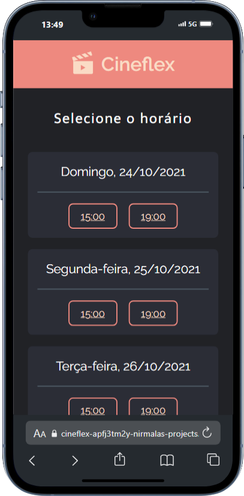

# 🎬 **Cineflex**  

<p align="center">
  
  
  
  
</p>  

---

## 🛠 **Tecnologias Utilizadas**  
- **React.js**: Biblioteca para criação de interfaces dinâmicas  
- **JavaScript**: Linguagem de programação principal    
- **Styled-Components**: Estilização com CSS-in-JS  
- **NPM**: Gerenciador de pacotes  

---

## 📽️ **Sobre o Projeto**  
O **Cineflex** é um app de reserva de ingressos de cinema que permite a escolha de filmes, sessões e assentos com feedback visual, proporcionando uma experiência de compra prática e intuitiva.  

---

## 📂 **Rotas do Projeto**  

### 🏠 **Página Inicial – Lista de Filmes**  
Veja os filmes disponíveis com seus pôsteres.  

 
<a href="https://cineflex-hx8wjdt2o-nirmalas-projects.vercel.app/"></a>  

---

### 🎥 **Sessões Disponíveis para um Filme**  
Escolha a data e horário para assistir ao filme.  

  
  

---

### 🪑 **Seleção de Assentos**  
Escolha assentos disponíveis e preencha as informações de compra.  


  

---

### ✅ **Página de Sucesso**  
Veja o resumo do pedido com as informações da compra.  

  
  

---

## 🚀 **Como Executar Localmente**  

1. **Clone o repositório:**  
   ```bash
   git clone https://github.com/seu-usuario/cineflex.git
   ```  
2. **Acesse a pasta do projeto:**  
   ```bash
   cd cineflex
   ```  
3. **Instale as dependências:**  
   ```bash
   npm install
   ```  
4. **Inicie o projeto:**  
   ```bash
   npm start
   ```  

---

## 💡 **Funcionalidades**  
- **Exploração de filmes**: Veja pôsteres e detalhes.  
- **Seleção de sessões e assentos**: Assentos reservados ficam indisponíveis.  
- **Simulação de compra**: Exibe um resumo completo da compra.  

---

## 👤 **Desenvolvido por**  
<p align="center">
  <a href="https://www.linkedin.com/in/nirmala-fonseca-a577b3255/">
    
  </a>
</p>  

---

## 📝 **Licença**  
Este projeto está sob a licença MIT.  

---

## 🤝 **Contribuições**  
Contribuições são sempre bem-vindas! Sinta-se à vontade para abrir issues ou enviar pull requests.  

---

<p align="center">
  Feito por Nirmala Fonseca
</p>  


