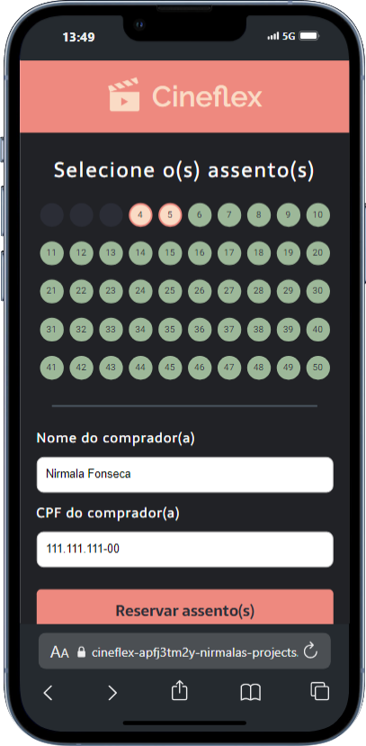
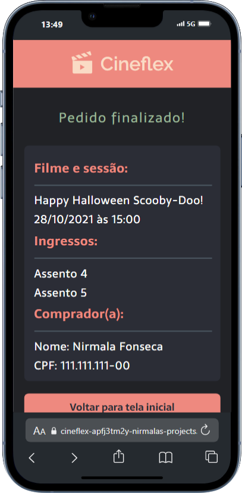

# 🎬 **Cineflex**  

<p align="center">
  
  
  
  
</p>  

---

## 🛠 **Tecnologias Utilizadas**  
<p align="center">
  - **React.js**: Biblioteca para criação de interfaces dinâmicas  
  <br />
  - **JavaScript**: Linguagem de programação principal  
  <br />
  - **Styled-Components**: Estilização com CSS-in-JS  
  <br />
  - **NPM**: Gerenciador de pacotes  
</p>  

---

## 📽️ **Sobre o Projeto**  
<p align="center">
  O **Cineflex** é um app de reserva de ingressos de cinema que permite aos usuários escolher filmes, sessões e assentos com feedback visual, proporcionando uma experiência prática e intuitiva.
</p>

---

## 📂 **Rotas do Projeto**  

### 🏠 **Página Inicial – Lista de Filmes**  
<p align="center">
  Exibe os filmes disponíveis com seus pôsteres.
  <br />
  <a href="https://cineflex-apfj3tm2y-nirmalas-projects.vercel.app/">
    
  </a>
</p>  

---

### 🎥 **Sessões Disponíveis para um Filme**  
<p align="center">
  Escolha a data e horário desejados para assistir ao filme.
  <br />
  📌 **Rota:** `/sessions/:idFilm`  
  <br />
  
</p>  

---

### 🪑 **Seleção de Assentos**  
<p align="center">
  Escolha assentos disponíveis e preencha as informações de compra.
  <br />
  📌 **Rota:** `/seats/:idSession`  
  <br />
  
</p>  

---

### ✅ **Página de Sucesso**  
<p align="center">
  Veja o resumo da compra com os detalhes dos assentos e dados do cliente.
  <br />
  📌 **Rota:** `/success`  
  <br />
  
</p>  

---

## 🚀 **Como Executar Localmente**  

<p align="center">
  1. **Clone o repositório:**  
</p>  
```bash
git clone https://github.com/seu-usuario/cineflex.git
```  

<p align="center">
  2. **Acesse a pasta do projeto:**  
</p>  
```bash
cd cineflex
```  

<p align="center">
  3. **Instale as dependências:**  
</p>  
```bash
npm install
```  

<p align="center">
  4. **Inicie o projeto:**  
</p>  
```bash
npm start
```  

---

## 💡 **Funcionalidades**  
<p align="center">
  - **Exploração de filmes**: Veja pôsteres e detalhes.  
  <br />
  - **Seleção de sessões e assentos**: Assentos reservados ficam indisponíveis.  
  <br />
  - **Simulação de compra**: Exibe um resumo completo da compra.
</p>

---

## 👤 **Desenvolvido por**  
<p align="center">
  <a href="https://www.linkedin.com/in/nirmala-fonseca-a577b3255/">
    
  </a>
</p>  

---

## 📝 **Licença**  
<p align="center">Este projeto está sob a licença MIT.</p>  

---

## 🤝 **Contribuições**  
<p align="center">Contribuições são sempre bem-vindas! Sinta-se à vontade para abrir issues ou enviar pull requests.</p>  

---

<p align="center">  
  Feito por Nirmala Fonseca  
</p>  

